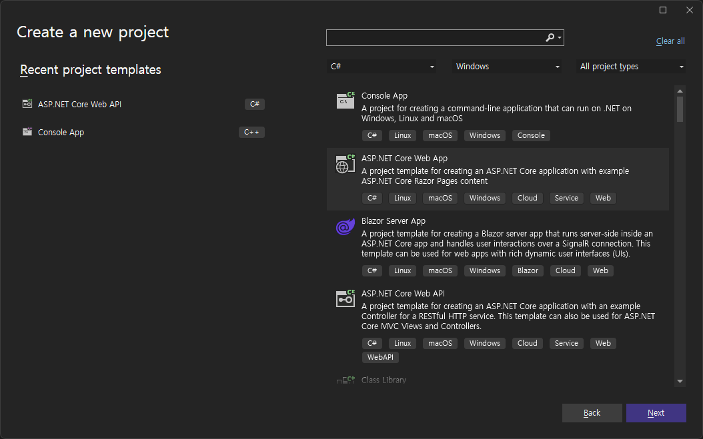
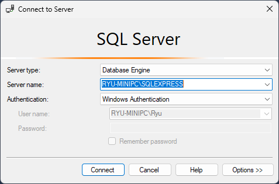
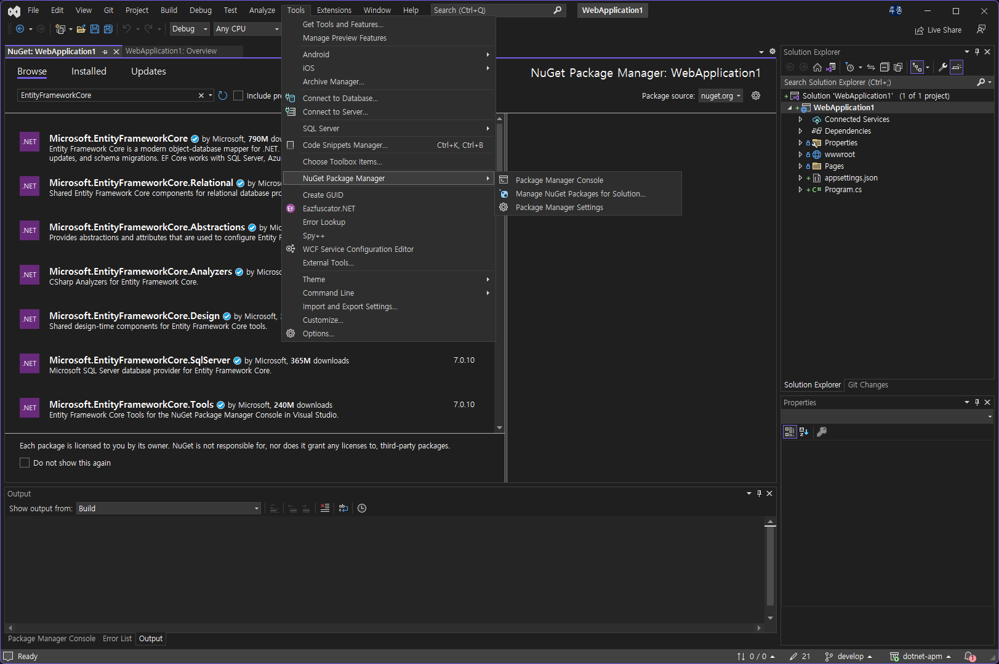

# ASP.NET Core API - Hello world


## 새로운 프로젝트 시작



* ASP.NET Core Web App을 선택하고 새로운 프로젝트를 생성합니다.


## NuGet 패키지 설치

"EntityFrameworkCore"로 검색해서 아래 세 개의 패키지를 설치합니다.

* Microsoft.EntityFrameworkCore.Design
* Microsoft.EntityFrameworkCore.SqlServer
* Microsoft.EntityFrameworkCore.Tools


## Connection string 설정

appsettings.json 파일을 여시고 아래와 같이 SQL 서버 접속 정보를 추가합니다.
Server는 다음 색션 설명을 참고하시고요.
Database는 원하시는 이름 아무거나 사용하셔도 됩니다.

``` json
{
  "Logging": {
    "LogLevel": {
      "Default": "Information",
      "Microsoft.AspNetCore": "Warning"
    }
  },
  "AllowedHosts": "*",
  "ConnectionStrings": {
    "DefaultConnection": "Server=RYU-MINIPC\\SQLEXPRESS;Database=DemoRestCore;Trusted_Connection=True;MultipleActiveResultSets=true; TrustServerCertificate=True;"
  }
}
```

### Server 이름 가져오는 방법




## WeatherForecast.cs 수정

``` csharp
using System.ComponentModel.DataAnnotations;
using System.ComponentModel.DataAnnotations.Schema;

namespace RestDemo
{
    public class WeatherForecast
    {
        [Key]
        [DatabaseGenerated(DatabaseGeneratedOption.Identity)]
        public int Id { get; set; }

        public DateTime Date { get; set; }

        public int TemperatureC { get; set; }

        public int TemperatureF { get; set; }

        public string? Summary { get; set; }
    }
}
```


## DatabaseContext class 추가

``` csharp
using Microsoft.EntityFrameworkCore;

namespace RestDemo
{
    public class DatabaseContext: DbContext
    {
        public DatabaseContext(DbContextOptions<DatabaseContext> options) : base(options)
        {
        }

        public DbSet<WeatherForecast> WeatherForecasts { get; set; }

        protected override void OnModelCreating(ModelBuilder modelBuilder)
        {
            modelBuilder.Entity<WeatherForecast>().HasData(
                new WeatherForecast
                {
                    Id = 1,
                    Date = new DateTime(2021, 8, 22),
                    TemperatureC = 25,
                    TemperatureF = 77,
                    Summary = "Hot"
                },
                new WeatherForecast
                {
                    Id = 2,
                    Date = new DateTime(2021, 8, 23),
                    TemperatureC = 20,
                    TemperatureF = 68,
                    Summary = "Warm"
                }
            );
        }
    }
}
```


## Program.cs 수정

``` csharp
...
builder.Services.AddDbContext<DatabaseContext>(options =>
    options.UseSqlServer(builder.Configuration.GetConnectionString("DefaultConnection")));
builder.Services.AddControllers();
...
app.Run();
```


## WeatherForecastController.cs 수정

``` csharp
using Microsoft.AspNetCore.Mvc;

namespace RestDemo.Controllers
{
    [ApiController]
    [Route("[controller]")]
    public class WeatherForecastController : ControllerBase
    {
        private readonly DatabaseContext _db;

        public WeatherForecastController(DatabaseContext databaseContext)
        {
            _db = databaseContext;
        }

        [HttpGet(Name = "GetWeatherForecast")]
        public ActionResult<IEnumerable<WeatherForecast>> Get()
        {
            return Ok(_db.WeatherForecasts.ToList());
        }
    }
}
```


## Database Migration



### 마이그레이션 파일이 생성

```
Add-Migration InitialCreate
```

### 데이터베이스에 마이그레이션 적용

```
Update-Database
```