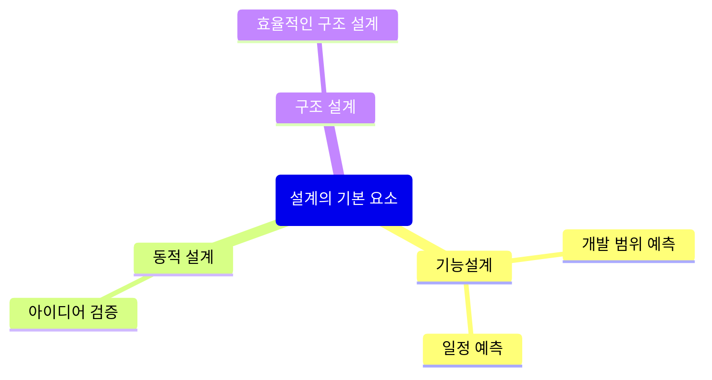
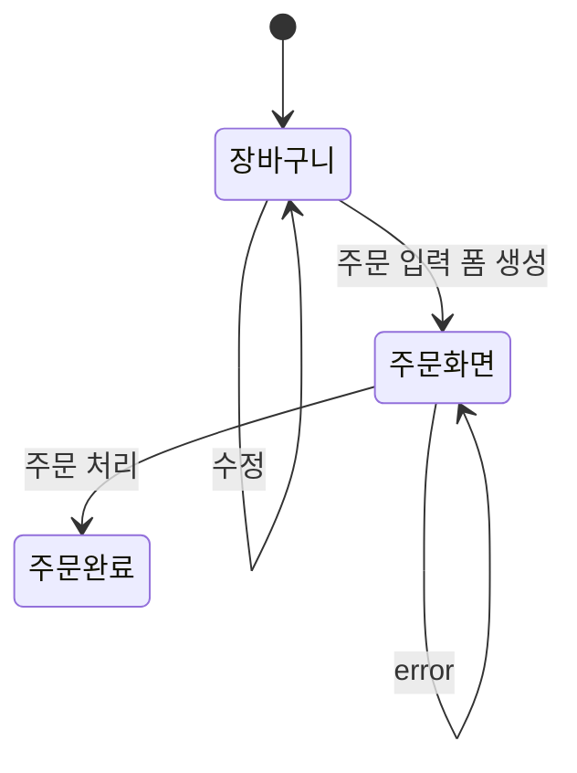

# 설계의 핵심요소 살펴보기

## 설계의 기본 요소

## 구체적인 설계 방법

* 기능 설계
  * 기능 목록
* 동적 설계
  * 상태 다이어그램
  * 시퀀스 다이어그램
* 구조 설계
  * ERD
  * 화면 레이아웃
  * 클래스 다이어그램

## 상태 다이어그램을 이용한 네비게이션 설계

## 화면 레이아웃

### 장바구니

### 주문화면

