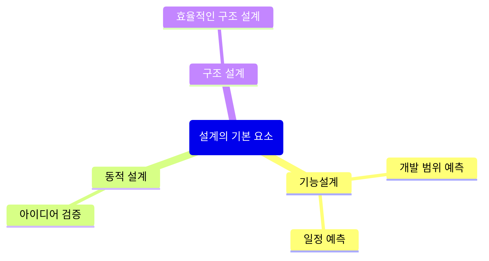
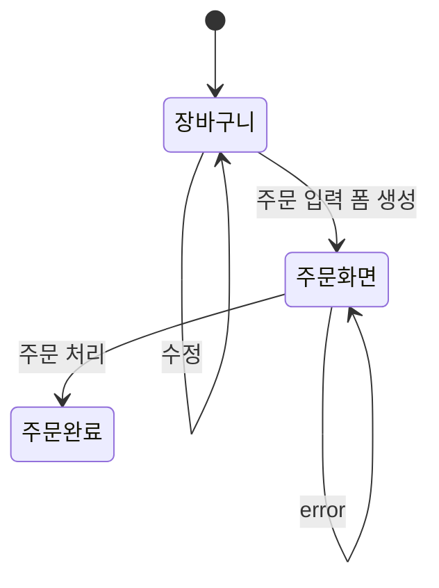
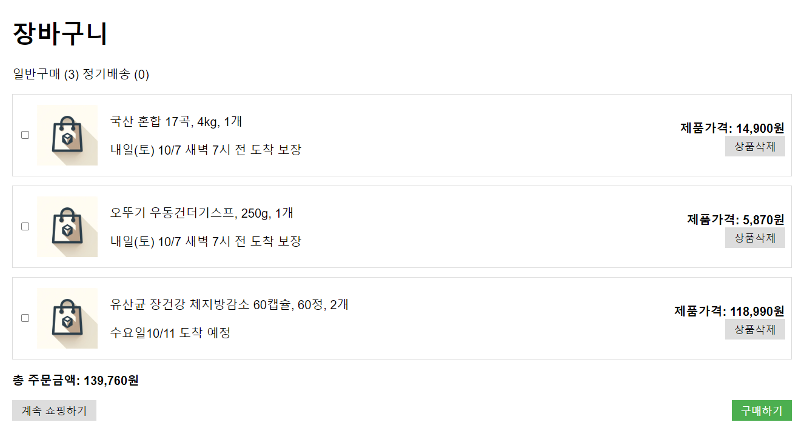
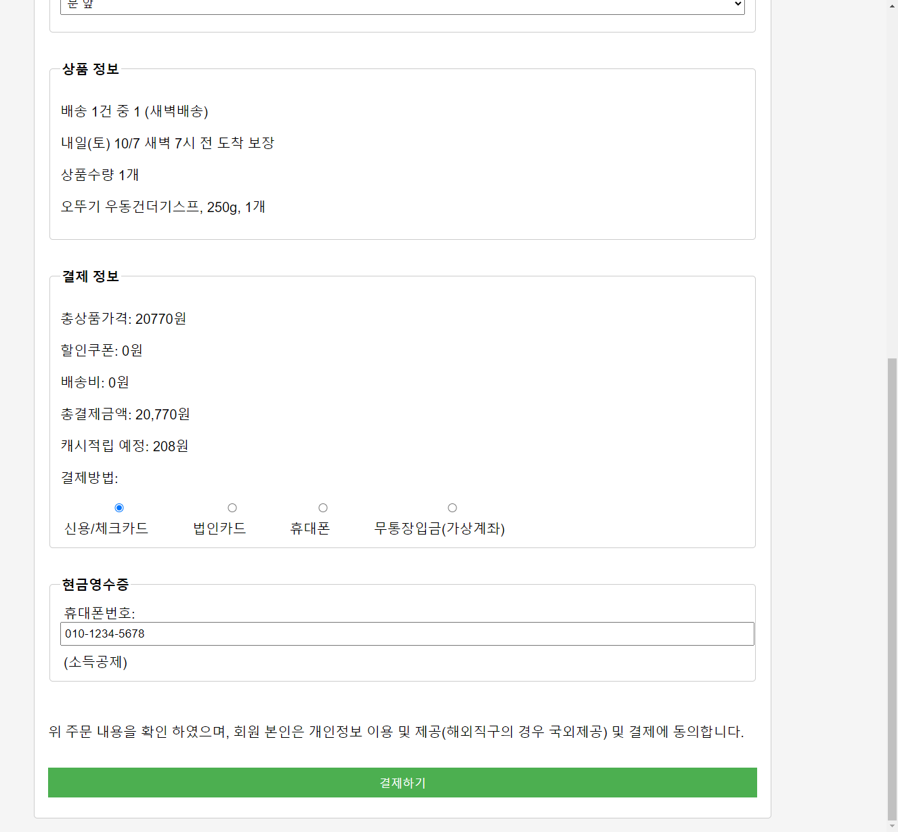

# 설계의 핵심요소 살펴보기

## 설계의 기본 요소

## 구체적인 설계 방법

* 기능 설계
  * 기능 목록
* 동적 설계
  * 상태 다이어그램
  * 시퀀스 다이어그램
* 구조 설계
  * ERD
  * 화면 레이아웃
  * 클래스 다이어그램

## 상태 다이어그램을 이용한 네비게이션 설계

* 모든 흐름을 한 곳에서 설명할 필요는 없습니다. 적당한 크기의 시나리오를 정하여 여러 개의 다이어그램을 통해서 작은 문제로 조각내는 편이 더욱 효율적입니다.
* 주문화면에서 배송지를 선택하는 과정을 다이어그램에 표시하는 것도 고려해볼 수 있습니다.
  * 저는 메인에 해당하지 않은 비주류 흐름은 생략하는 편입니다. 하지만, 이것이 절대적인 권유는 아닙니다.
  * 또한 팝업창으로 표현되는 프로세스는 배제하는 편입니다. 이또한 각자가 선택할 일입니다.

여기서 제가 강조하고 싶은 부분은 동적 설계를 통해서 매우 작은 비용으로 요구 사항과 아이디어를 검증할 수 있다는 것입니다.

기능목록을 분석했을 때 주문 생성은 하나의 프로세스로 생각했으나, 동적 설계를 통해서 숨은 요구사항을 발견하였습니다. 주문 생성은 `주문 입력 폼 생성`과 `주문 처리` 두 개의 프로세스임을 알게 된 것이고, 이전 영상에서 이를 반영하게 된 것입니다.

* [이전영상 - 03. 쇼핑몰 주문관리 구축하기 #1](https://youtu.be/wk37jupuxIU)

## 화면 레이아웃

### 장바구니

* [장바구니 html 소스](./cart.html)

### 주문화면

* [주문 입력 폼 html 소스](./order.html)