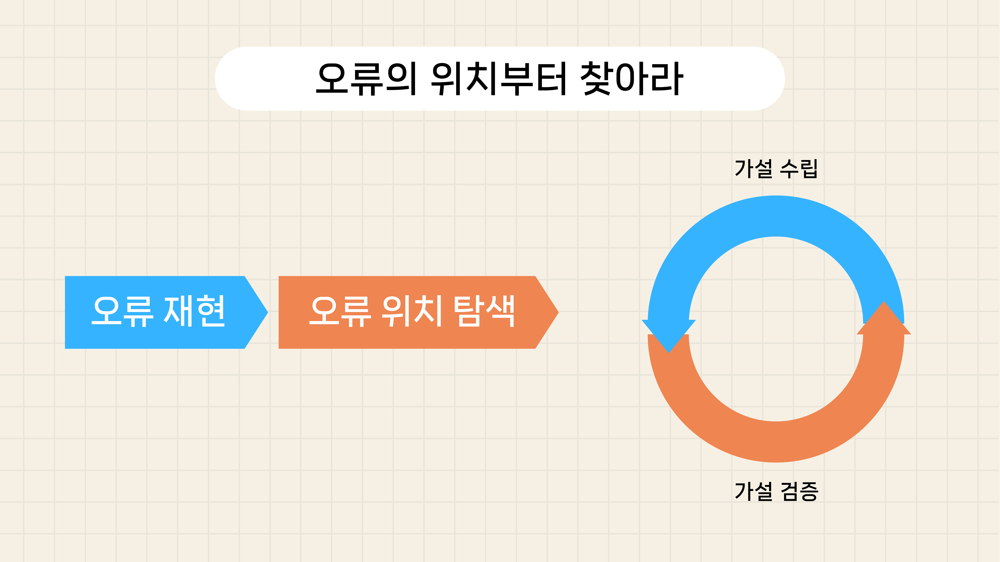
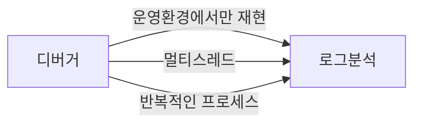
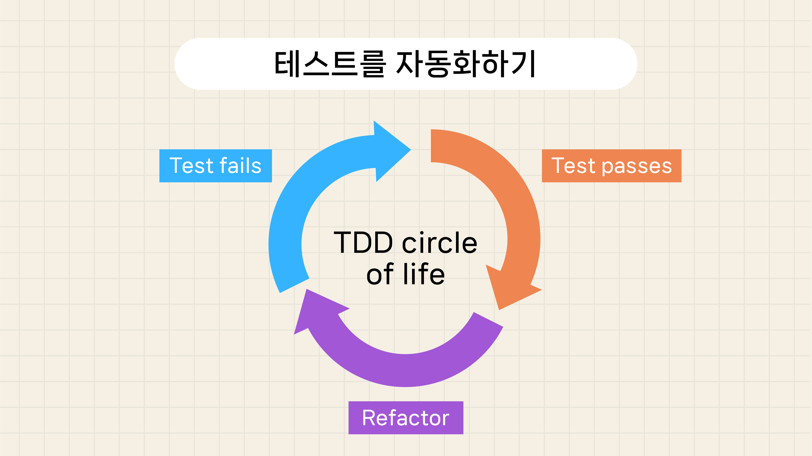
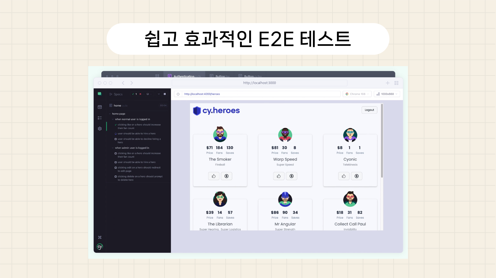
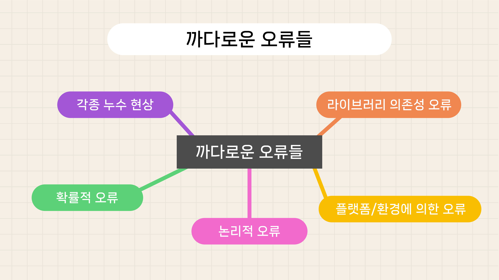

# 초보 개발자를 위한 디버깅 비법 (영상 녹화 대본)

## 들어가기

이번 영상에서는 프로그래밍을 하다가 에러가 났을 때
대처하는 방법에 대해서 다뤄보도록 하겠습니다.

## 에러 메시지에 답이 있다

제가 초보시절에 선배들에게 가장 많이 들었던 조언입니다.

그런데 생각해보면
과연 초보 개발자가
오류 메시지를 보고 바로 해결 방법을 찾아 낼 수 있을까 하는 의문이 듭니다.

하지만 요즘은 인공지능에게 에러메시지를 복사해서 던져주기만해도
상당히 만족스러운 답변을 얻을 때가 많습니다.

오류와 관련된 소스를 함께 복사해주면
좀 더 정확한 답변을 만들어주기도 합니다.

그러니 낯 설은 에러메시지가 보이더라도
당황하지 말고 인공지능을 한 번 사용해 보는 것을 권해드립니다.

## 오류의 위치부터 찾아라

오류 메시지가 없는 논리적인 오류이거나
오류 메시지를 직관적으로 이해하기 어려운 경우도 많습니다.

그래서 저는 초보 개발자들에게
해결하기 힘든 오류를 발견하면
오류의 위치부터 찾으라고 요청합니다.

오류의 위치를 바로 알 수 없는 경우도 많은데요.

이러한 경우에는 오류를 재현하는 방법을 먼저 찾아야 합니다.

오류를 직접 발생시켜가면서
반복적인 접근을 통해서 오류의 위치가 발생하는 지 찾아내는 것입니다.

코드 실행이 오류를 직접적으로 재현한다면,
코드를 절반씩 주석처리하면서 찾을 수도 있고요.

그렇지 않은 경우라면
디버거나 로그를 통해서
예상하는 것과 다른 값이나 프로세스 흐름이 발생하는 지점을 찾아내야 합니다.

오류의 재현 방법, 위치를 추적하다보면 많은 실마리를 찾을 수 있고요.

적합한 오류 발생 시나리오들을 찾아내고 검증하기가 쉽습니다.

나아가서
직접처리하기 힘든 경우 선배 개발자들에게 도움을 청할 때에도
이정도의 준비는 해서 문의하는 것이 예의입니다.

## 디버거 활용하기

지금 보시는 화면은
비주얼 스튜디오에서 디버거를 실행시킨 장면입니다.

많은 개발 도구들이 디버깅 환경을 제공하고 있습니다.

우선은 오류난 부분이 원래 예측했던 기대값들을 정리하고,
실행결과가 예측에서 벗어나는 위치나 흐름을 찾아야 합니다.

코드를 한 줄 한 줄 실행하면서,
변수의 값들의 변화를 추적하는 것을 기본으로 시작하시면 됩니다.

디버깅 툴이 제공하는 다양한 옵션들보다는
다양한 상황에서의 디버깅 활용 경험이 필요합니다.

결국 시간과 반복 연습 밖에 답이 없습니다.

## 로그 활용하기

사용자가 실제 사용하는 상황에서만 재현되는 오류 등과 같은 경우에는
디버거를 이용해서 충분한 검토가 되지 않을 수 있습니다.

멀티스레드 환경이나
짧은 시간에 수많은 반복이 일어나는 등의 경우에도
디버거를 이용하는데 한계가 있을 수 있습니다.

이러한 경우에는 로그에서 힌트를 찾을 수 있습니다.

저의 경우에는 상황에 맞춰서 간단한 로그 분석기를 만들어서 사용하는 경우가 많습니다.

예를 들어 트랜잭션이 시작되었는데,
같은 id를 가진 트랜잭션 종료 로그가 없다면
자동으로 검출해서 표시되도록 하는 코드를 작성하는 것입니다.

## 테스트를 자동화하기

테스트를 자동화하는 것은 정말 중요합니다.

사람은 결국 실수를 하기 마련이기 때문에,
코드의 변화가 있을 때마다
미리 준비된 테스트 케이스들을 자동으로 검증하는 것만으로도
상당한 시간을 절약할 수 있습니다.

불안감을 해소하는 것도 개발에 집중하는데 상당한 도움이 됩니다.

코드를 작성하기 전에 테스트를 먼저 생각하는 것도 좋은 방법일 수는 있지만,
이것이 생각보다 어려운 경우가 많습니다.

그러한 경우에는
버그를 수정할 때마다 그에 대한 테스트 케이스를 추가하여
회귀 테스트 케이스를 구축하는 것도 좋습니다.

## 쉽고 효과적인 E2E 테스트

프로그램을 배포하기 전에
사용자 입장에서 자동으로 검증할 수 있는 방법이 있는데요.

자세한 것은 cypress나 Selenium을 검색해보시기 바랍니다.

이것을 E2E 테스트라고 하는데요.

사용자가 로그인 한 다음 상단의 버튼을 클릭했을 때
가끔 에러가 난다고 가정하겠습니다.

cypress에게 이러한 테스트 케이스를 스크립트로 작성해주면
직접 웹브로우져를 띄우고 로그인 한 다음 버튼을 클릭하고
결과를 표시하거나 알려주게 됩니다.

따라서 개발자는 코드만 푸시하면,
자동으로 가상의 사용자가 프로그램을 정해진 시나리오대로 사용해보고
문제가 있는 지 알려주는 툴이라고 생각하시면 됩니다.

## 까다로운 오류들

오류의 다양한 종류 중에서도 특히나 까다로운 것들이 존재하는데요.

이에 관해서는 동영상 설명란에 있는 문서 링크를 참고하시기 바랍니다.

### 확률적 오류 (Heisenbug)
- **원인**: 프로그램의 비결정적 요소에 의해 예측할 수 없게 동작할 때 발생합니다. 멀티스레딩, 메모리 관리, 디펜던시 이슈 등에서 자주 발생합니다.
- **해결 방법**:
  - 로깅을 통해 프로그램 상태 기록 및 추적
  - 스레드 동기화 검토 및 데드락 방지
  - 무작위 테스트 또는 퍼지 테스트로 재현 및 분석
  - 안정적 환경에서의 반복 실행으로 특성 파악

### 논리적 오류 (Logical Error)
- **원인**: 코드 내의 잘못된 논리로 인해 예상과 다른 결과가 발생하는 경우. 개발자의 오류나 오해에서 비롯됩니다.
- **해결 방법**:
  - 코드의 논리를 단계별로 검증 및 단위 테스트 실시
  - 코드 리뷰를 통한 오류 발견과 논리 검증
  - 조건문 및 반복문의 경계 조건 재검토 및 리팩토링

### 각종 누수 현상 (Leaks)
- **원인**: 메모리 누수, 자원 누수 등으로 사용한 자원을 제대로 반환하지 않아 발생합니다.
- **해결 방법**:
  - 메모리 프로파일러로 할당 및 해제 추적
  - 자원 관리 자동화 패턴 적용 (예: RAII)
  - 메모리 관리 필요 언어에서 가비지 컬렉션 활용

### 라이브러리 의존성 오류 (Dependency Hell)
- **원인**: 호환되지 않는 버전의 라이브러리 사용이나 필요한 라이브러리의 부재에서 발생합니다.
- **해결 방법**:
  - 패키지 매니저로 의존성 관리
  - 프로젝트별 가상 환경 사용
  - 컨테이너화 도구로 일관된 환경 구축

### 플랫폼/환경에 의한 오류 (Platform-specific Bugs)
- **원인**: 운영 체제, 하드웨어, 네트워크 환경 등의 차이로 인해 프로그램이 다르게 동작합니다.
- **해결 방법**:
  - 크로스 플랫폼 개발 도구 활용
  - 다양한 환경에서의 테스트 및 검증
