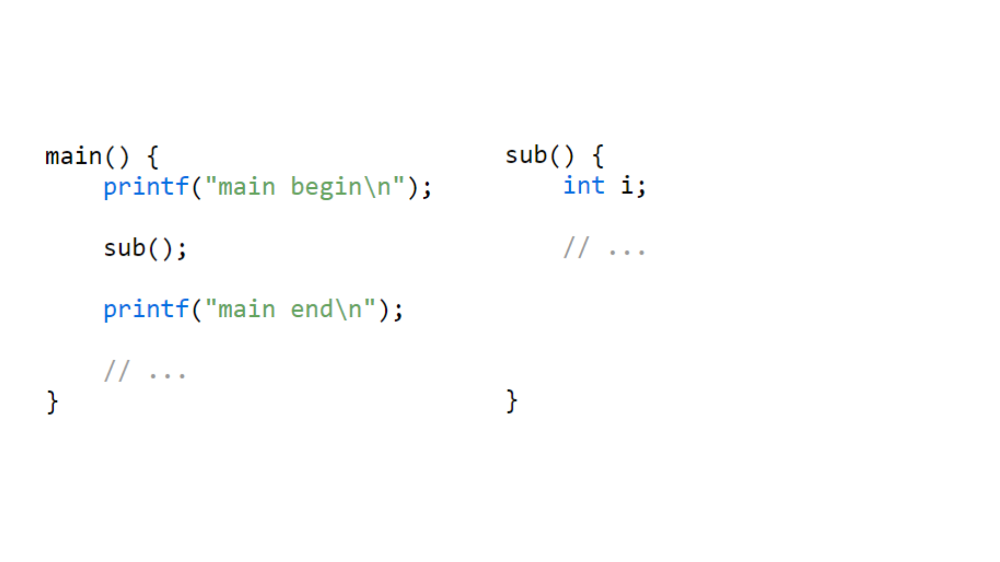
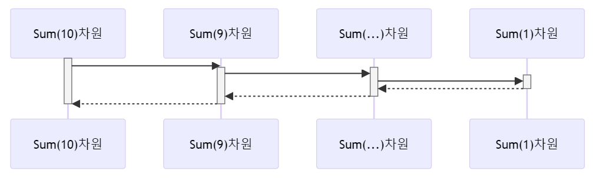

---



---


---


---

``` csharp
int total = 0;
for (int i = 1; i <= 10; i++)
{
    total += i;
}
Console.WriteLine(total);
```

---

``` csharp
Sum(10) = [1 + 2 + 3 + 4 + 5 + 6 + 7 + 8 + 9] + [10]
```

---

``` csharp
Sum(9) = [1 + 2 + 3 + 4 + 5 + 6 + 7 + 8 + 9]
Sum(10 ) = Sum(9) + [10]
```

---

``` csharp
Sum(10 ) = Sum(9) + [10]
Sum(9 ) = Sum(8) + [9]
…
Sum(n) = Sum(n-1) + n
```

---

``` csharp
public static int Sum(int n)
{
    if (n == 1)
        return 1;
    else
        return Sum(n - 1) + n;
}

Console.WriteLine(Sum(10));
```

---



---

## 재귀호출의 장점
* 복잡한 문제를 간단하고 우아하게 표현
* 코드의 가독성
* 높은 유지보수성

## 재귀호출의 단점
* 메모리 사용량이 많음
* 비효율적 성능
* 스택 오버플로우 등의 제약

---

