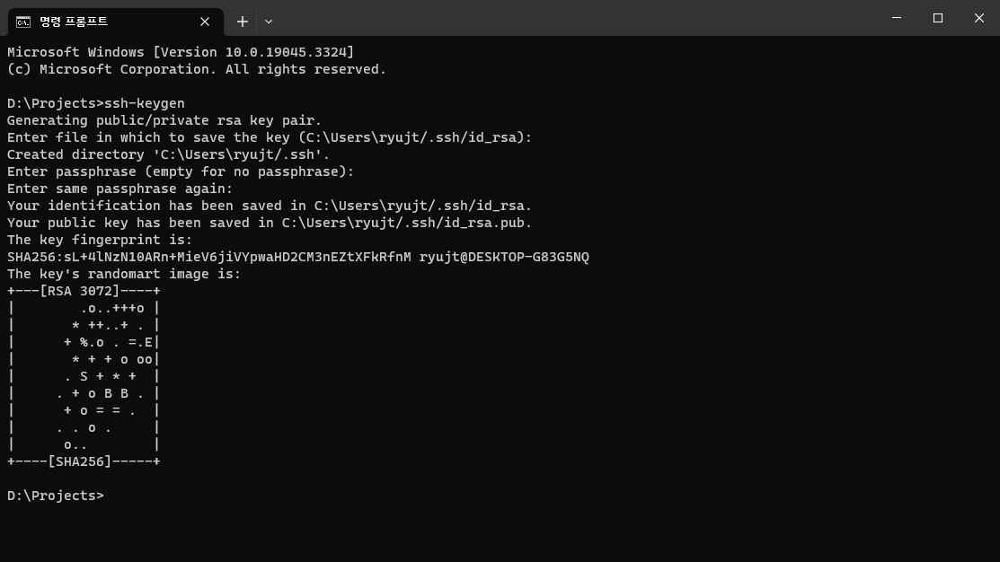
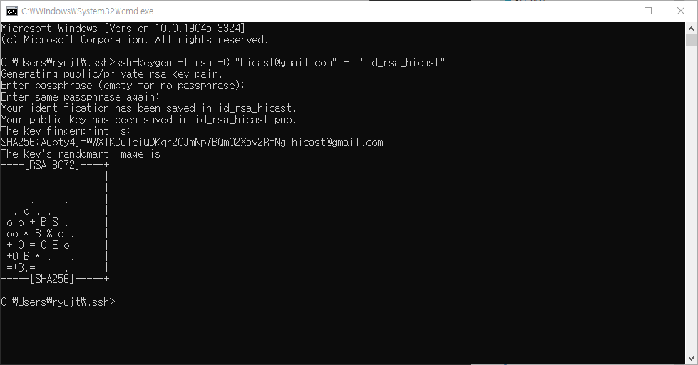

# Github에 여러 계정의 SSH 키 설정하기


## 계정이 하나 일 때 SSH 키 등록




## 계정이 하나 이상일 때 SSH 키 등록

### 파일 이름을 지정해서 SSH 키 생성하기

```
ssh-keygen -t rsa -C "이메일" -f "파일 이름"
```

### 새로운 계정 생성의 예

```
ssh-keygen -t rsa -C "hicast@gmail.com" -f "id_rsa_hicast"
```




## config 파일 설정

```
Host github.com-hicast
    HostName github.com
    User HiCast
    IdentityFile ~/.ssh/id_rsa_hicast
```


## git clone

config에 등록하지 않은 처음에 만든 계정의 경우에는 기존의 방식대로 사용하시면 됩니다.

```
git clone [저장소 주소]
```

config에 등록했던 두 번째의 경우에는 git@github.com:HiCast/test.git라는 저장소를 가져올 때,
다음과 같이 config에 설정한 주소를 사용하시면 됩니다.

```
git clone git@github.com-hicast:HiCast/test.git
```