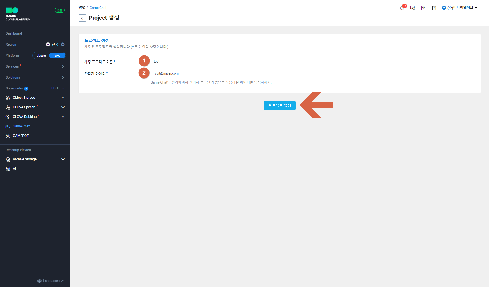
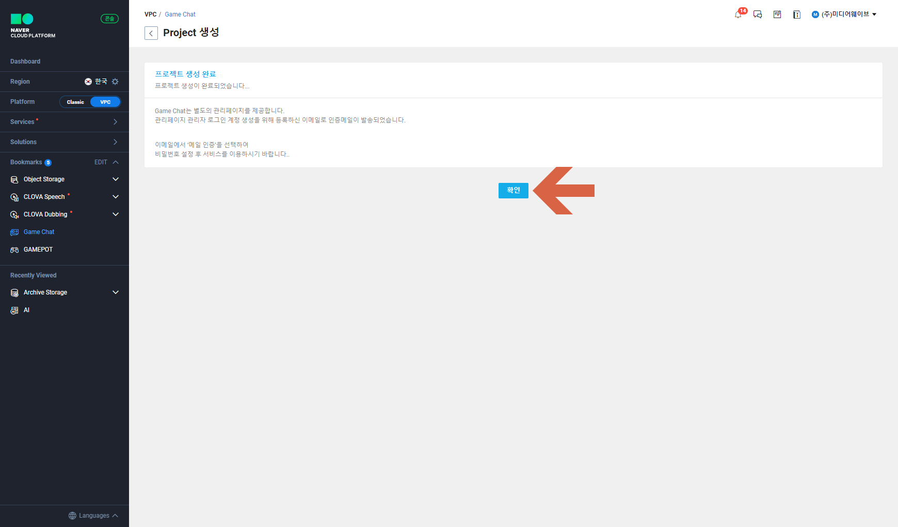
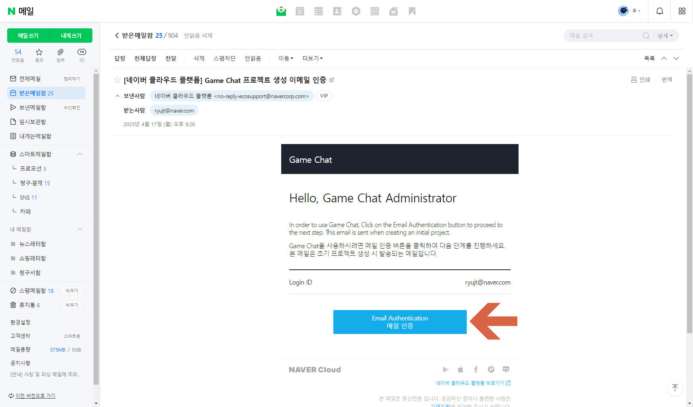
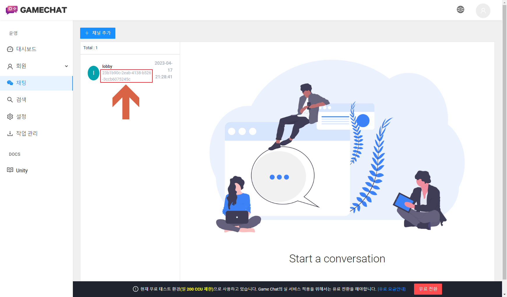
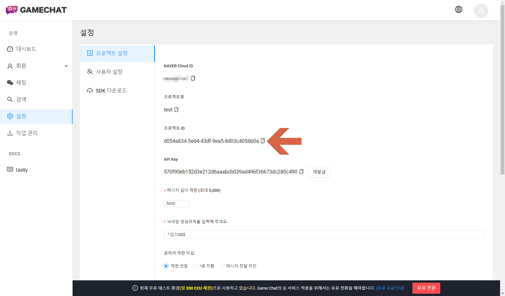

# Naver Cloud Game Chat을 이용한 채팅 예제


## Game Chat 설정












## 채팅 소스

### GameChat.min.js 다운받기

* [GameChat.min.js](https://kr.object.ncloudstorage.com/gamechat/gamechat.min.js)
* [Game Chat JavaScript SDK 사용법](https://guide.ncloud-docs.com/hansem/docs/game-gamechat-javascriptsdk)

### 예제 소스

``` js
<!DOCTYPE html>
<html lang="en">

<head>
    <meta charset="UTF-8">
    <meta http-equiv="X-UA-Compatible" content="IE=edge">
    <meta name="viewport" content="width=device-width, initial-scale=1.0">

    <head>
        <script src="GameChat.min.js"></script>
    </head>

    <title>Naver GameChat</title>
</head>

<body>
    <div>
        <input type="text" name="userId" id="userId">
        <button id="btLogin">login</button>
    </div>
    <br><br>

    <div>
        <input type="text" name="msg" id="msg">
        <button id="btSend">send</button>
    </div>
</body>

</html>

<script>
    var projectId = "[프로젝트 ID]";
    var channelId = "[채널 ID]";

    var gc = new gamechat.Chat();
    gc.initialize(projectId);

    gc.bind('onMessageReceived', function (channel, message) {
        console.log("onMessageReceived: ", message);
    });

    gc.bind('onErrorReceived', function (channel, message) {
        console.log("onErrorReceived: ", message);
    });

    gc.bind('onConnected', async function (channel, message) {
        console.log("onConnected", message);

        while (!gc.isConnected()) {
            await new Promise(resolve => setTimeout(resolve, 50));
        }

        gc.subscribe(channelId);
        await new Promise(resolve => setTimeout(resolve, 1000));
        console.log("subscribed");
    });

    gc.bind('onDisconnected', function (reason) {
        console.log("onDisconnected");
    });

    window.onload = function () {
        document.getElementById("btLogin").addEventListener("click", function () {
            var userId = document.getElementById("userId").value;
            gc.setUser({
                id: userId,
                name: "Nickname",
            });
            gc.connect(userId, (err, res) => {
                if (err) console.log(err);
            });
        });

        document.getElementById("btSend").addEventListener("click", function () {
            var msg = document.getElementById("msg").value;
            gc.sendMessage(channelId, msg);
        });
    }
</script>
```