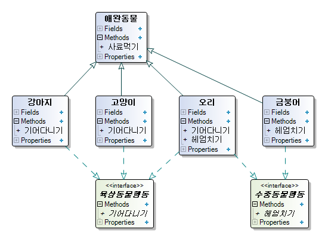

# 클래스 상속과 인터페이스 구현의 차이

<iframe width="800" height="450" src="https://www.youtube.com/embed/1Zl1Mpw6NPk?si=5BflKp6oqzJPlAK8" title="YouTube video player" frameborder="0" allow="accelerometer; autoplay; clipboard-write; encrypted-media; gyroscope; picture-in-picture; web-share" allowfullscreen></iframe>

## 기본적인 개념

결론부터 말한다면,
* 클래스 상속은 is-a 관계를 나타냅니다.
* 인터페이스 구현은 can-do 관계를 나타냅니다.

 그리고, is-a 관계는 태생부터 무엇인가 기질을 타고 난 경우를 말합니다.
 부모가 황인종이기 때문에 저도 황인종입니다.
 이것은 상속 받은 유전적이며 선천적인 형질입니다.

저는 태어나면서부터 프로그래밍을 할 줄 알았던 것은 아니지만, 지금은 할 줄 알고 있습니다.
이런 후천적인 형질은 can-do 관계라고 할 수 있습니다.

[그림 1]

[그림 1]을 보면 "자식"은 부모에게 유전적 형질을 물려 받게 됩니다.
이 관계는 is-a 입니다.

그러나, 자식은 프로그래밍으로부터 유전되지 않습니다.
단지 배워서 프로그래밍을 할 수 있을 뿐 입니다.
이러한 관계는 can-do 입니다.

일반적인 프로그래밍 언어에서는 유전적 상속은 단 하나의 클래스로부터만 가능합니다.
하지만, 인터페이스의 경우에는 다중 상속이 가능합니다.
프로그래밍을 한다고 해서 피아노를 배우지 못하란 법은 없습니다.

프로그래밍을 하는데 있어서도 이렇게 관계를 분리해야 할 경우가 있습니다.
그러나, 칼로 자르듯이 "이런 경우에는 반드시 상속(is-a)를 통해서 해결해야 하고,
저런 경우에는 인터페이스(can-do)를 이용해서 해결해야 한다"라고 말하기는 어렵습니다.
설계자가 어느 정도 상황을 인지하여 결정을 내리는 수 밖에 없습니다.
다만, 최대한 자신의 개성이 아닌 보편적으로 이해 될 수 있는 구조를 갖출 수록 값진 설계가 될 것 입니다.

## 프로그래밍 환경에서 다시 살펴보기

애완동물 샵 관리 프로그램을 작성하려는데, 현재 샵에서 판매하고 있는 동물들은 [그림 2]와 같습니다.

[그림 2]

[그림 2]의 동물들에 대한 클래스를 보니, 사료먹기가 중복되고 있습니다.
중복은 프로그래밍 7거 지악 중에 하나입니다.
제거합니다.
제거하는 방법으로는 위임과 상속이 있습니다.
오늘은 주제가 상속과 인터페이스 구현이므로 상속을 통해서 처리하겠습니다.
그리고, 그 결과가 [그림 3] 입니다.

[그림 3]

[그림 3]에서는 사료먹기를 애완동물 클래스에 정의하고 다른 클래스들은 애완동물 클래스를 상속 받아 사용하고 있습니다.
고질적인 문제인 "중복"은 확실히 제거 되었습니다.

그런데, 요구사항이 갑자기 늘었습니다.
강아지와 고양이는 "기어다니기" 기능이 있어야 하고, 금붕어의 경우에는 "헤엄치기"가 필요해 졌습니다.

[그림 4]

[그림 4]처럼 요구사항을 처리했으나, 이번에는 "기어다니기"가 중복되고 있습니다.
이번에도 상속을 통해서 처리하도록 하겠습니다.

[그림 5]

[그림 5]와 같이 이번에도 요구사항을 처리했으나 또 다시 새로운 요구사항이 들어 옵니다. (이 바닥이 원래 그렇잖아요 ㅡ.ㅡ)
취급 동물이 하나 더 늘었습니다.
이번에 취급해야 하는 것은 오리 입니다.

[그림 6]

[그림 6]을 보시면 아시겠지만, 곤란한 문제가 생겼습니다.
오리는 육상동물 행동인 "기어다니기"도 하고, 수중동물인 금붕어와 같이 "헤엄치기"도 합니다.
양쪽의 형질을 모두 이어 받으려면 다중상속이 필요한 순간입니다.
다중상속은 대부분의 언어가 지원하지도 않고, 지원한다고 해도 무분별하게 사용하면 추후 감당하기 어려운 문제에 봉착하게 됩니다.

[그림 6]의 경우에는 상속이 두 단계에 거쳐서 일어나면서 "최대한 상속으로 피해라"라는 원칙에도 위배 됩니다. (상속은 장점도 있지만, 그에 따른 비용이 큽니다)

[그림 7]

[그림 7]은 이러한 단점들을 인터페이스를 통해서 처리한 내용입니다.
즉, "기어다니기"와 "헤엄치기"를 유전적 형질로 보지 않고, 후천적 형질로 보고 처리한 것 입니다.
상속의 단계도 줄어들었고, 다중상속 문제도 해소되었습니다.
앞으로 추가적인 형질이 늘어난다고 해도, 상속 단계를 늘리지 않고 해결 할 수 있는 구조입니다.

오리가 **"나는 기어 다닐수도 있고, 헤엄칠 수도 있다"** 라고 말하고 있습니다.

그러나, 여기에도 문제는 있습니다.
인터페이스는 코드를 공유하지 않고 단지 인터페이스만 공유하는 것 입니다.
결국 "기어다니기"와 "헤엄치기" 코드는 모든 클래스에 중복되어 구현되고 있습니다.

[그림 8]

[그림 8]에서는 중복되는 "기어다니기"와 "헤엄치기" 코드를 각각 "기어가기" 클래스와 "헤엄치기" 클래스에 옮겨두고, 각각의 애완동물 클래스들은 이 클래스에게 해당 기능을 위임하여 처리하고 있습니다.
또한 인터페이스를 통해서 애완동물을 상속받은 모든 클래스가 얼마든지 애완동물 행동을 추가하고 변경할 수 있도록 되어 유연성이 높아졌습니다.

## 정리

상속과 인터페이스 구현이 왜 필요한 지를 생각해 보겠습니다.
* 코드의 공유
  * 상속은 중복된 코드를 제거하여 이를 상속 받는 클래스들이 코드를 공유 할 수 있도록 합니다.
* 인터페이스의 공유
  * OOP로 프로그래밍을 하다보면 수 많은 객체들을 다루게 됩니다. 만약 특정 객체들이 동일한 호출방식(인터페이스)를 갖고 있다면, 객체의 타입을 무시하고 이를 호출 할 수 있게 됩니다. 이것을 다형성이라고 부르며, 조건문을 제거하고도 객체의 종류의 따라 같은 제어(흐름)에서 다른 결과를 얻을 수 있게 됩니다.

하지만, 코드의 공유는 위임을 통해서도 처리 할 수 있기 때문에, 상속보다는 위임을 우선으로 생각해보는 것이 좋습니다.

인터페이스의 공유는 클래스 상속과 인터페이스 구현 모두 가능합니다.
다만, 상속의 경우에는 다중 상속의 벽에 부디칠 수도 있고, 남발하면 코드의 유지 보수가 어려워 질 수 있습니다.
결국, 클래스 상속과 인터페이스 구현 중 하나를 선택해야 하며, 그 기준은 해당 관계가 "is-a" 인가 또는 "can-do" 인가를 보고 결정하시면 됩니다.
