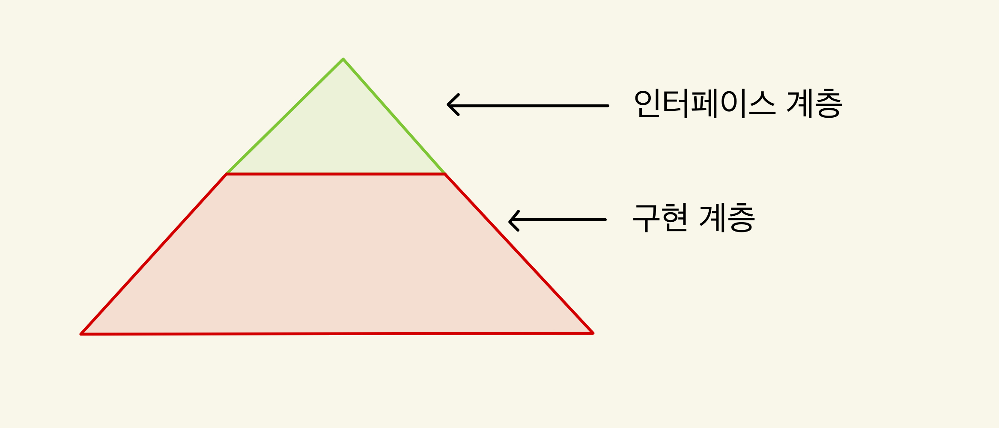

# 동적설계를 통해서 시스템 설계하기

소프트웨어 모델링에서 동적 모델링은 중요한 역할을 합니다.
많은 경우, 소프트웨어 설계는 건축 설계와 비교되며 구조적 구성에 초점을 맞추지만,
프로그램의 동적인 측면은 건축물과는 다르게 중요합니다.

이 글에서는 동적 모델링의 세 가지 측면에서 설명하려고 합니다.
* 시스템의 전체 줄거리를 대략적으로 설계하여 이해하기 쉬운 상태로 만들기
* 줄거리만으로 부족한 부분들을 찾아서 구체적인 동작을 설명하기
* 교통 정리가 필요한 복잡한 조건 다루기

## 전체의 줄거리를 먼저 생각하기

복잡한 시스템 설계 시, 전체의 줄거리를 먼저 잡는 것이 중요합니다.
구체적인 부분에 집중하기 전에 전체적인 윤곽을 파악하는 것이 전체 시스템의 이해에 도움을 줍니다.
시스템 구성도나 패키지 다이어그램과 같은 구조적 도구와 함께,
이벤트 중심의 다이어그램을 통해 동적 설계를 시각화하는 것이 유용합니다.

구체적이고 국지적인 이야기에 너무 집중하게 되면 전체의 윤곽을 이해하는데 어려움을 느끼게 되는데요.
이는 마치 미로에 가까이 있을수록 출구를 찾기 어려운 것과 같습니다.
그래서 시작은 추상적인 높은 래벨에서의 뷰를 가지고 시스템을 이해하는 것이 좋습니다.

이 접근법은 복잡한 시스템을 간단한 모듈로 분해하고,
이 모듈들이 서로 어떻게 상호작용하는지를 파악하는 것입니다.
이를 통해 시스템을 전체적으로 이해하는 대신, 인터페이스와 구현 계층을 분리하여 접근합니다.

다이어그램 작성법과 보다 구체적인 원리와 알고 있어야 할 핵심 내용은 아래의 동영상 설명을 참고하시기 바랍니다.
* [이벤트 중심의 다이어그램](https://youtu.be/89gT4bL7xbU?si=2RsZEBKc7Ui9-d45)

## 구체적인 이야기 채우기

전체 줄거리가 설정되면, 다음 단계는 구체적인 내용을 채우는 것입니다.
이 과정에서는 절차 중심의 시퀀스 다이어그램이 자주 사용됩니다.
모든 세부 사항에 집중하는 것은 과설계로 이어질 수 있으므로,
중요하거나 복잡한 부분에 집중하는 것이 바람직합니다.
설계는 완성품이 아니라, 목표 방향을 설정하는 과정입니다.

다이어그램 작성법과 보다 구체적인 원리와 알고 있어야 할 핵심 내용은 아래의 동영상 설명을 참고하시기 바랍니다.
* [절차 중심의 다이어그램](https://youtu.be/s44xYsNuvKs?si=ijAhNEidOoICU7eI)

## 복잡한 조건을 다루기

프로그램을 복잡하게 만드는 주요 요소 중 하나는 다양한 조건들입니다.
이 조건들은 프로그램의 동작을 복잡하게 만들며, 때로는 신호등처럼 교통 정리가 필요합니다.
상태도는 이러한 조건들을 관리하고 흐름을 정리하는데 유용합니다.

다이어그램 작성법과 보다 구체적인 원리와 알고 있어야 할 핵심 내용은 아래의 동영상 설명을 참고하시기 바랍니다.
* [상태 중심의 다이어그램](https://youtu.be/dymihe2djfA?si=xGAIYxNQZgS7bGqZ)

## 남겨진 이야기

프로그래밍에서 동적 모델링이 중요하지만, 구조적 모델링과의 균형도 중요합니다.
구조적 모델링은 시스템의 기본적인 구성을 이해하는 데 필수적이며, 동적 모델링과 함께 시스템의 전체적인 이해를 도울 수 있습니다.

시간이 나는대로 설계에 대한 이야기를 계속 다룰 예정이며, 이전의 올려둔 아래 영상과 게시물도 참고하시기 바랍니다.

* [초보 개발자를 위한 설계 비법](https://www.whatap.io/ko/blog/152/index.html)
* [데이터베이스 설계 비법](https://www.youtube.com/watch?v=SRJNHmk4kok&list=PLdJpJI2SrqEn7_HhVcrQHEmpaCWphVTfr)
* [인터페이스와 클래스 상속의 차이](https://youtu.be/1Zl1Mpw6NPk?si=UzTLFvOoOCdgSyHF)
