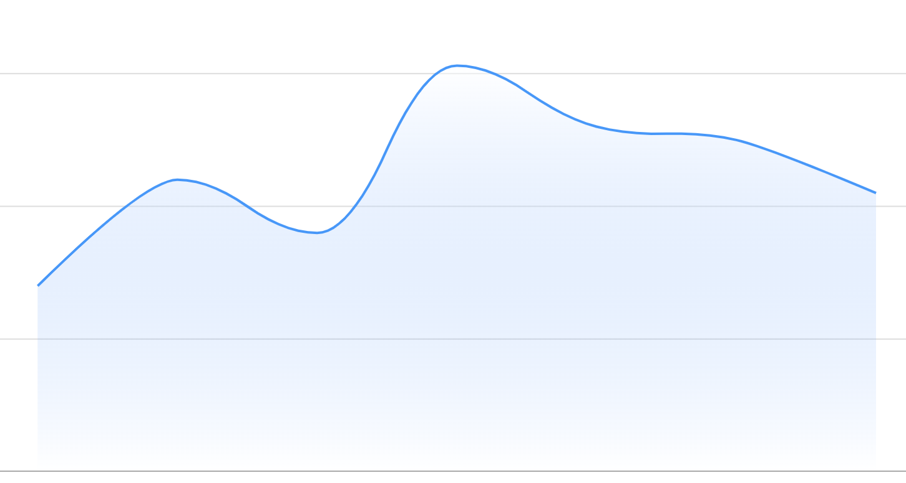
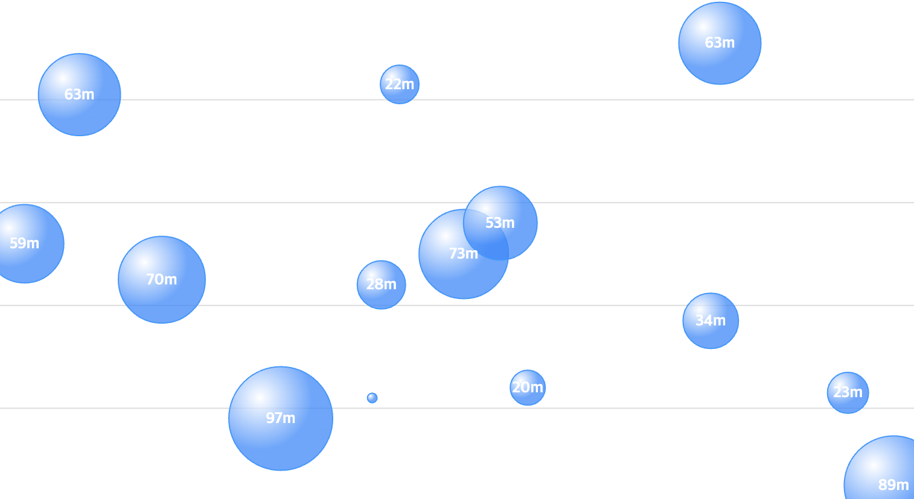
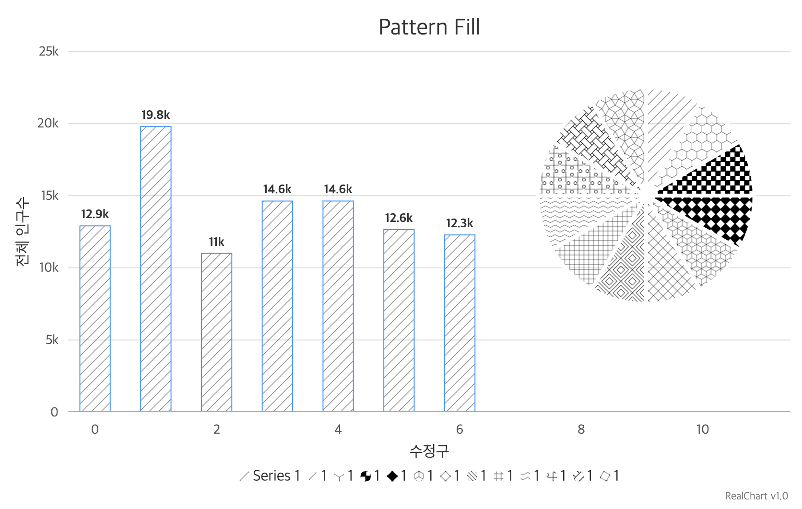

# Style 및 꾸미기


## 기본 코드

``` html
<html>
<head>
    <title>Home</title>
    <link href="./realchart-style.css" rel="stylesheet">
    <script type="text/javascript" src="./realchart-lic.js"></script>
    <script type="text/javascript" src="./realchart.0.9.43.min.js"></script>
</head>
<body>
    <div id="chart" style="width: 800px; height: 500px;">
    </div>
    <script>
        const config = {
            series: {
                data: [5, 7, 12, 16, 10, 8, 11, 8.5],
            },
        };
        RealChart.createChart(document, 'chart', config);
    </script>
</body>
</html>
```

## Series 스타일

``` html
<html>
...
<body>
    ...
    <script>
        const config = {
            series: {
                data: [5, 7, 12, 16, 10, 8, 11, 8.5],
                type: 'line',
                style: {
                    stroke: 'red',
                    strokeWidth: 10,
                    strokeDasharray: '4'
                }
            },
        };
        ...
    </script>
</body>
</html>
```

## Rich Text

``` html
<html>
...
<body>
    ...
    <script>
        const config = {
            series: {
                ...
                tooltipText: '<b>${name}</b><br>${series}:<b> ${yValue;0;#,##0.0}</b>',
            },
        };
        ...
    </script>
</body>
</html>
```

## Text 스타일

``` html
<html>
...
<body>
    ...
    <script>
        const config = {
            series: {
                ...
            },
            title: {
                text: 'Style 및 꾸미기',
                style: {
                    fontSize: '32px',
                    fontWeight: 'bold',
                    fill: '#333',
                    fillOpacity: 0.1
                }
            }
        };
        ...
    </script>
</body>
</html>
```

## 에셋(Assets)

### colors

``` js
{
    assets: [
        {
            type: 'colors',
            id: 'color1',
            colors: ['#88f', '#aaf', '#bbf', '#ddf', '#eef'],
            mode: 'sㅗuffle'
        }
    ],
    series: {
        pointColors: 'color1',
    }
}
```

### Linear Gradient

``` js
{
    assets: [
        {
            type: 'lineargradient',
            id: 'gradient-1',
            color: '#0088ff',
            opacity: [1, 0]
        }
    ],
    series: {
        style: {
            fill: 'url(#gradient-1)',
            fillOpacity: 1,
            strokeWidth: '2px'
        }
    }
}
```




### Radial Gradient

``` js
{
    assets: [
        {
            type: 'radialgradient',
            id: 'gradient-1',
            color: '#0088ff',
            cx: 0.3,
            cy: 0.3,
            rd: 0.4
        }
    ],
    series: {
        type: 'bubble',
        style: {
            fill: 'url(#gradient-1)'
        }
    }
}
```



### Pattern

``` js
{
    assets: [
        {
            type: 'pattern',
            id: 'pattern-1',
            pattern: 0,
            style: {
                stroke: 'black',
            }
        }
    ],
    series: {
        style: {
            fill: 'url(#pattern-1)'
        }
    }
}
```



## 참고자료

* [스타일(Style)](https://www.realchart.co.kr/guide/style)
* [에셋(Assets)](https://www.realchart.co.kr/guide/assets)
